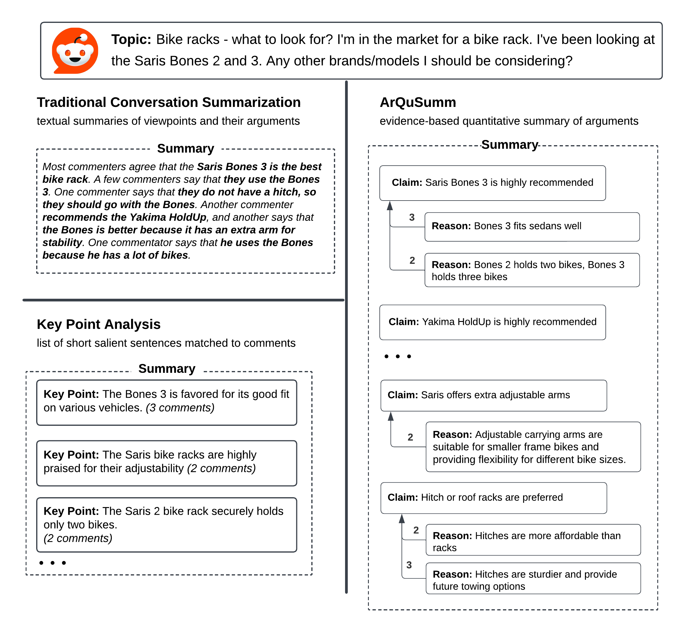
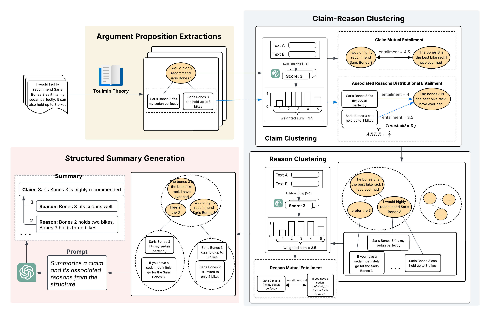

<div align="center">

# ArQuSumm

</div>

This repository maintains the code, data for the paper *ArQuSumm: Argument-aware Quantitative Summarization
of Online Conversations*.

We explored a new task, Argument-aware Quantitative Summarization to generate 
reveal and summarize the claim-reason structure of arguments in conversations.




[//]: # (# Code to release soon.)

## Installation
It is recommended to set up the environment and install required libraries using conda. 
It is also recommended that the machine should have GPUs to perform inference at a reasonable time.  
### 1. Create new virtual environment by
```bash
conda create --name arqusumm python=3.9
conda activate arqusumm
```
### 2. Install Pytorch
#### Windows or Linux
##### Using GPUs
```bash
conda install pytorch torchvision torchaudio pytorch-cuda=11.8 -c pytorch -c nvidia
```
##### Using CPU
```bash
conda install pytorch torchvision torchaudio cpuonly -c pytorch
```
#### Mac
```bash
conda install pytorch::pytorch torchvision torchaudio -c pytorch
```
For other versions, please visit: [https://pytorch.org/get-started/locally/](https://pytorch.org/get-started/locally/)

### 3. Additional packages
We need some additional packages to run the code. The list of packages is listed in ```requirements.txt```. On the main directory of the repository, run:
```bash
pip install -r requirements.txt
```

# Framework

We propose a pipeline framework for Argument-aware Quantitative Summarization, namely ArQuSumm
for generating claim-reason structured summary.
To reveal the underlying argument structure within sentences, ArQuSumm leverages LLM few-shot learning grounded in the argumentation theory to identify propositions within sentences and their claim-reason relationships.
For quantitative summarization, ArQuSumm employs argument structure-aware clustering algorithms to aggregate arguments and quantify their support. 
ArQuSumm consists of 3 components/stages:
- **Stage 1: Argument Proposition Extraction**
- **Stage 2: Argument-aware Clustering**
- **Stage 3: Structured Summary Generation**

## Dataset
We released data from the **NYT**, **Reddit** and **StackExchange** domains used in our evaluation tasks (dimensions) of claim-reason structured summaries.
The data derives from the ```test``` set of the [ConvoSumm dataset](https://github.com/Yale-LILY/ConvoSumm?tab=readme-ov-file#data) from the corresponding domains, which contains 250 examples per domain. 
 
Datasets can be accessed under the ```data/``` folder, 
following the [```nyt/```](/data/nyt), [```reddit/```](/data/reddit), and [```stack/```](/data/stack) subdirectories for each dataset.

Files in each folder:
* ```raw_input.csv```: Raw input comments and crowdsourced summaries collected from ConvoSumm dataset.
* ```source_comments_arg_extracted.csv```: Comments already analyzed for ABSA predictions &#40;Stage 1&#41;
* ```claim_clustered.csv```: clusters of claims extracted from user comments &#40;Stage 2&#41;
* ```claim_reason_clustered.csv```: clusters of reasons supporting claim clusters &#40;Stage 2 &#41;
* ```summaries.csv```: Claim-reason structured summary generated from claim and reason clusters &#40;Stage 3 &#41;
* ```gold_summaries_arg_extracted.csv```: Claims, reasons extracted from crowdsourced summaries (for automatic evaluation)

[//]: # (The code data collected from the [repository]&#40;https://github.com/Yale-LILY/ConvoSumm&#41; of the paper "*ConvoSumm: Conversation Summarization Benchmark and Improved Abstractive Summarization with Argument Mining*")


